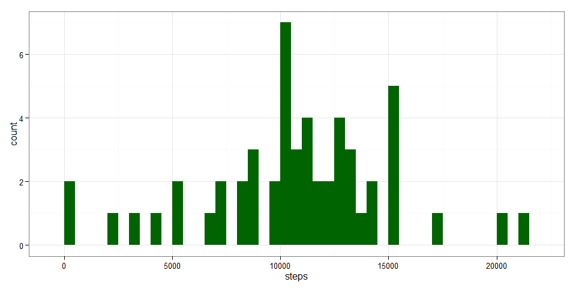
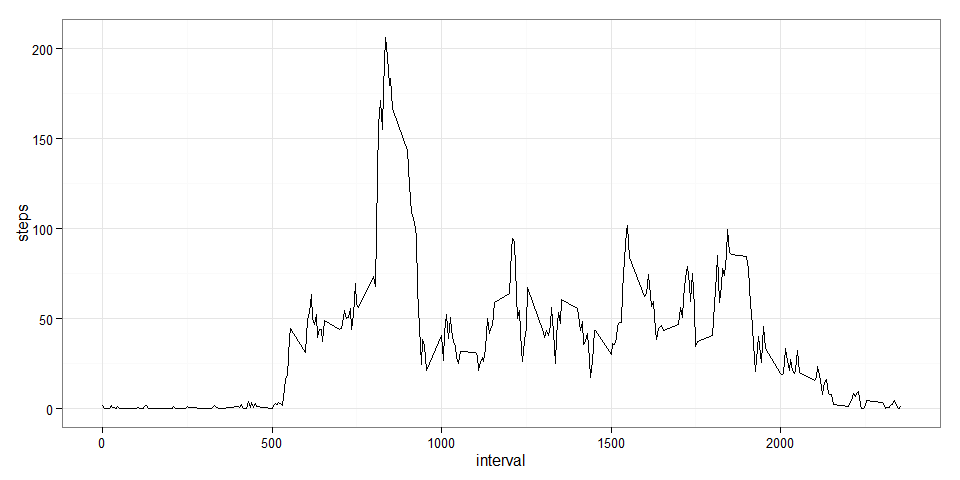
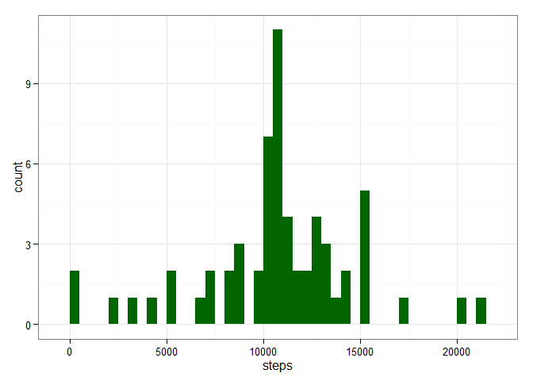
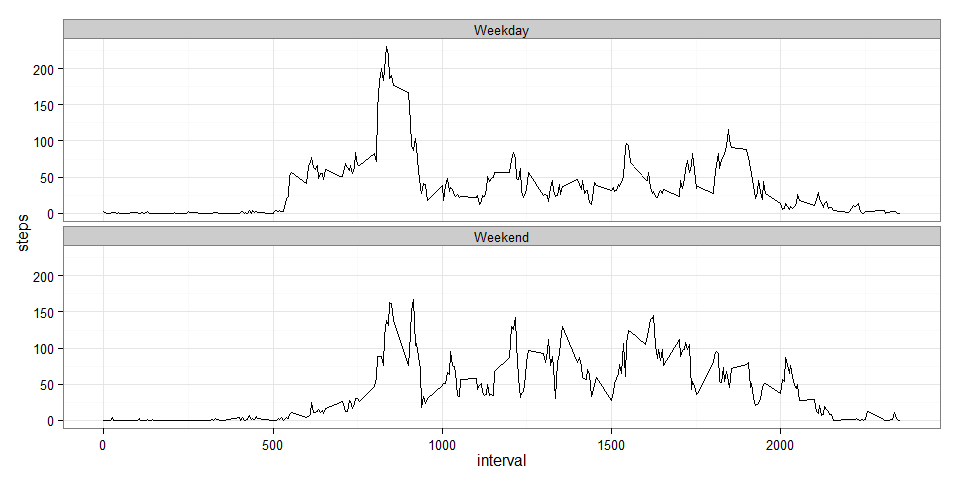

# Reproducible Research: Peer Assessment 1


## Loading and preprocessing the data

```r
unzip("activity.zip", "activity.csv")
rawdata <- read.csv("activity.csv")
```

## What is mean total number of steps taken per day?
Let's start by looking at distribution of daily step totals.  The following chart shows the frequency of the daily total in ranges of 500 steps.


```r
dailysteps <- aggregate(steps ~ date, data = rawdata,sum)
library(ggplot2)
plot1 <- ggplot(dailysteps, aes(steps))
plot1 + geom_histogram(fill = "darkgreen",
                       binwidth = 500) + 
    theme_bw(base_size = 12)
```

 

But what about the average daily total?

```r
meansteps <- as.character(round(mean(dailysteps$steps),2))
mediansteps <- median(dailysteps$steps)
```
The mean total daily steps is 10766.19 and the median is 10765.  
  
## What is the average daily activity pattern?
How does the time interval pattern change across the day?

```r
intmeansteps <- aggregate(steps ~ interval, data = rawdata, mean)
plot2 <- ggplot(intmeansteps, aes(interval, steps))
plot2 + geom_line()+ 
     theme_bw(base_size = 12)
```

 

So, what time of day is the most active?  We can answer this by looking at the time interval with the largest average steps.

```r
maxint <- round(head(intmeansteps[order(-intmeansteps$steps),],1),2)
```

The time interval with the highest number of steps across the period is 835, with an average of 206.17 steps each day.

## Imputing missing values
In this sort of analysis, large volumes of missing values have the potential to skew the results.  Let's look at the scale of the missing values in this dataset.  


```r
na_rows <- nrow(rawdata[is.na(rawdata$steps),])
raw_rows <- nrow(rawdata)
missing <- round(nrow(rawdata[is.na(rawdata$steps),]) / nrow(rawdata) * 100,0)
```
  
There are 2304 missing values.  So, for 13% of the rows in the raw data, we don't know how many steps were taken.  
  
If we assume that the number of steps taken during each interval where that is missing is equal to the mean of steps taken in that interval across the whole time period, how will that change the results we've calculated above?  
  
To answer this, we'll duplicate the original data, replace the missing values and then rerun the first chart and recalculate the averages.

```r
impdata <- rawdata ##Duplicate raw dataset
## Add new column to hold the mean steps for the interval
impdata$avesteps <- round(intmeansteps[match(impdata$interval,
                                             intmeansteps$interval)
                                       ,2] ## Take the avg steps from intmeansteps dataset
                          ,0) ## Rounded to 0 dp to give integer value
impdata[is.na(impdata$steps),1] <- impdata[is.na(impdata$steps),4] ## Update missing steps
impdata <- impdata[,1:3] ## Remove the additional column

dailysteps2 <- aggregate(steps ~ date, data = impdata,sum)
meansteps2 <- as.character(round(mean(dailysteps2$steps),2))
mediansteps2 <- as.character(median(dailysteps2$steps))
plot3 <- ggplot(dailysteps2, aes(steps))
plot3 + geom_histogram(fill = "darkgreen",
                       binwidth = 500) + 
    theme_bw(base_size = 12)
```

 

The new mean total daily steps is 10765.64 and the median is 10762.  The distribution of daily totals is very similar, with only the frequency of daily totals between 10,500 and 11,000 changing.  The average daily total values are also little changed.  
  
So, the impact of imputing the missing values in this way is low.  
  
## Are there differences in activity patterns between weekdays and weekends?
Let's recast the second chart, putting in the imputed missing values and splitting it into two panels, one for weekdays and the other for weekend days.

```r
library(lubridate)
impdata$weekpart <- "Weekday"
impdata[substr(weekdays(ymd(impdata$date)),1,1)=="S",4] <- "Weekend"
intmeansteps2 <- aggregate(steps ~ interval + weekpart, data = impdata, mean)
plot4 <- ggplot(intmeansteps2, aes(interval, steps))
plot4 + geom_line()+ 
    theme_bw(base_size = 12)+
    facet_wrap( ~ weekpart, ncol = 1)
```

 
